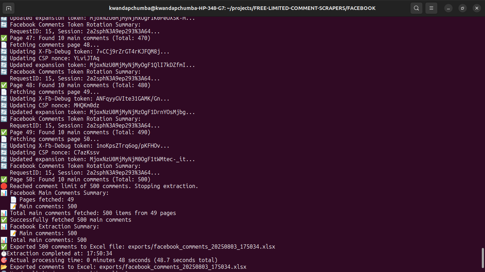
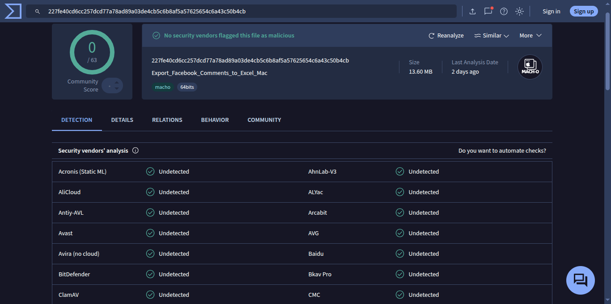
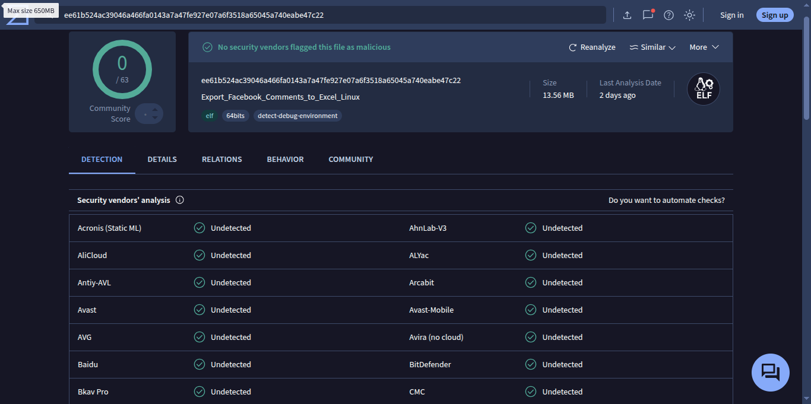

# 📱 Facebook Comment Scraper

Extract unlimited **main comments** from Facebook posts, reels, and shares with ease. This tool is designed for researchers, marketers, and social media analysts who need to analyze Facebook engagement.

## 🎯 **Features**

- ✅ **Unlimited main comments** - no limits on main comments!
- ✅ Export to Excel with full metadata
- ✅ Cross-platform executables (Windows/Mac/Linux)
- ✅ Security verified with VirusTotal scans
- ✅ Real-time token rotation and progress tracking
- ✅ Support for various Facebook URL formats

## 🚀 **Quick Start**

### Option 1: Download Executable (Recommended)

Download the executable for your operating system from the `builds/` directory:

| Platform    | Architecture          | File Name                                    |
| ----------- | --------------------- | -------------------------------------------- |
| **Windows** | x64 (amd64)           | `facebook-comment-scraper-windows-amd64.exe` |
| **Linux**   | x64 (amd64)           | `facebook-comment-scraper-linux-amd64`       |
| **macOS**   | Intel (amd64)         | `facebook-comment-scraper-macos-amd64`       |
| **macOS**   | Apple Silicon (arm64) | `facebook-comment-scraper-macos-arm64`       |

#### 📥 **Installation Instructions**

**Windows:**

1. Download `facebook-comment-scraper-windows-amd64.exe`
2. Double-click to run (no installation required)

**Linux:**

1. Download `facebook-comment-scraper-linux-amd64`
2. Make executable: `chmod +x facebook-comment-scraper-linux-amd64`
3. Run: `./facebook-comment-scraper-linux-amd64`

**macOS (Intel):**

1. Download `facebook-comment-scraper-macos-amd64`
2. Make executable: `chmod +x facebook-comment-scraper-macos-amd64`
3. Run: `./facebook-comment-scraper-macos-amd64`

**macOS (Apple Silicon):**

1. Download `facebook-comment-scraper-macos-arm64`
2. Make executable: `chmod +x facebook-comment-scraper-macos-arm64`
3. Run: `./facebook-comment-scraper-macos-arm64`

### 📸 **Terminal Output Example**

The tool provides real-time feedback during extraction:



### Option 2: Build from Source

```bash
# Navigate to the Facebook scraper directory
cd FACEBOOK

# Install dependencies
go mod tidy

# Build the executable
go build -o facebook-comment-scraper main.go

# Run the scraper
./facebook-comment-scraper
```

### Option 3: Cross-Platform Build

```bash
# Use the automated build script
./build.sh

# This creates executables for all platforms in the builds/ directory
```

## 🔒 **Security Verified**

All executables have been scanned and verified safe by VirusTotal:

| Platform    | VirusTotal Scan                                           |
| ----------- | --------------------------------------------------------- |
| **Windows** | ✅ [Clean Scan](screenshots/windows-virus-total-scan.png) |
| **Mac**     | ✅ [Clean Scan](screenshots/mac-virus-total-scan.png)     |
| **Linux**   | ✅ [Clean Scan](screenshots/linux-virus-total-scan.png)   |

### 🔍 **Security Verification Screenshots**

All executables have been verified clean by VirusTotal:





## 📖 **Usage**

### Basic Usage

1. **Run the executable**
2. **Enter Facebook URL** when prompted
3. **Wait for extraction** to complete
4. **Check the exports folder** for your Excel file

### 📱 **Example Terminal Output**

When you run the tool, you'll see real-time progress like this:

```
📱 Facebook Comment Scraper
==================================================
This tool extracts main comments from Facebook posts, reels, and shares.
✅ Unlimited main comments extraction - no limits!

🔗 Enter Facebook URL (post/reel/share): https://web.facebook.com/share/p/19VpTAJJZo/
🔍 Detected Facebook share link (type: p) with ID: 19VpTAJJZo
🔄 Following redirect to get actual post URL...
✅ Share link redirected to: https://web.facebook.com/Intenseshadows/posts/pfbid02oLinieGFyrWfPHijTurF2FUSAkMKaUAPfjM4VhytxkmzMxyEPcxtLTq8e2cZrgpMl?rdid=ZKNQrStwcUyvWpHv&share_url=https%3A%2F%2Fweb.facebook.com%2Fshare%2Fp%2F19VpTAJJZo%2F
🔍 Found post slug: pfbid02oLinieGFyrWfPHijTurF2FUSAkMKaUAPfjM4VhytxkmzMxyEPcxtLTq8e2cZrgpMl
🔍 pfbid format detected: pfbid02oLinieGFyrWfPHijTurF2FUSAkMKaUAPfjM4VhytxkmzMxyEPcxtLTq8e2cZrgpMl
🔄 Converted pfbid to base64 post ID: ZmVlZGJhY2s6cGZiaWQwMm9MaW5pZUdGeXJXZlBIaWpUdXJGMkZVU0FrTUthVUFQZmpNNFZoeXR4a216TXh5RVBjeHRMVHE4ZTJjWnJncE1s
✅ Successfully extracted post ID: ZmVlZGJhY2s6cGZiaWQwMm9MaW5pZUdGeXJXZlBIaWpUdXJGMkZVU0FrTUthVUFQZmpNNFZoeXR4a216TXh5RVBjeHRMVHE4ZTJjWnJncE1s
⏱️ Extraction started at: 17:49:46
🔑 Initialized Facebook config with token rotation
📥 Fetching comments...
🔍 Starting to fetch main comments from post: ZmVlZGJhY2s6cGZiaWQwMm9MaW5pZUdGeXJXZlBIaWpUdXJGMkZVU0FrTUthVUFQZmpNNFZoeXR4a216TXh5RVBjeHRMVHE4ZTJjWnJncE1s
✅ Unlimited main comments extraction - no limits!
📄 Fetching comments page 1...
🔄 Updating X-Fb-Debug token: UJqr0/hmJwSjZ9PGnvjm...
🔄 Updating CSP nonce: nsRvsAOC
🔄 Updated expansion token: MjoxNzU0MjMyNTg5OgF1buYUCJEeTA...
🔄 Facebook Comments Token Rotation Summary:
   RequestID: 15, Session: 2a2sph%3A9ep293%3A64...
✅ Page 1: Found 10 main comments (Total: 10)
📄 Fetching comments page 2...
🔄 Updating X-Fb-Debug token: vqTUSPm+1f8HE5Sud50h...
🔄 Updating CSP nonce: JP1sQtKr
🔄 Updated expansion token: MjoxNzU0MjMyNTkwOgF1NAoDAryNMd...
🔄 Facebook Comments Token Rotation Summary:
   RequestID: 15, Session: 2a2sph%3A9ep293%3A64...
```

**Key Features You'll See:**

- 🔍 **URL Detection**: Automatically detects various Facebook URL formats
- 🔄 **Redirect Handling**: Follows Facebook share links to get actual post URLs
- 🔑 **Token Rotation**: Real-time token updates to maintain session
- 📊 **Progress Tracking**: Shows comments found per page and total count
- ✅ **Unlimited Main Comments**: No limits on main comments

### Supported URL Formats

The scraper automatically detects and handles various Facebook URL formats:

```
✅ https://web.facebook.com/share/p/1AguUnrRzz/ (Recommended)
✅ https://web.facebook.com/username/posts/pfbid123...
✅ https://web.facebook.com/groups/123456789/permalink/123456789/
✅ https://web.facebook.com/reel/123456789
✅ https://web.facebook.com/permalink.php?story_fbid=123456789
```

**💡 Pro Tip**: Share links are recommended as they're most reliable and automatically redirect to the actual post URL.

### Direct Input

You can also provide the URL as a command line argument:

```bash
./facebook-scraper "https://web.facebook.com/share/p/1AguUnrRzz/"
```

## 📊 **Output Format**

The tool exports data to Excel with the following columns:

| Column                | Description                                        |
| --------------------- | -------------------------------------------------- |
| **Comment ID**        | Unique Facebook comment identifier                 |
| **Author Name**       | Name of the comment author                         |
| **Author ID**         | Facebook user ID of the author                     |
| **Comment Text**      | The actual comment content                         |
| **Created Time**      | Timestamp when comment was posted                  |
| **Likes Count**       | Number of likes on the comment                     |
| **Reply Count**       | Number of replies to this comment                  |
| **Depth**             | Comment depth (0 for main comments)                |
| **Is Reply**          | Whether this is a reply (false for main comments)  |
| **Parent Comment ID** | ID of parent comment (empty for main comments)     |
| **Parent Author**     | Author of parent comment (empty for main comments) |
| **URL**               | Direct link to the comment                         |

## ⚙️ **Configuration**

### Token Rotation

The scraper automatically handles Facebook's token rotation:

- **Session Management**: Updates session tokens from responses
- **Request IDs**: Rotates through valid request sequences
- **Security Tokens**: Maintains valid authentication tokens
- **Rate Limiting**: Respects Facebook's API limits

## 🛠️ **Built With**

- **Go** - High-performance programming language
- **Excelize** - Excel file generation library
- **HTTP Client** - Robust HTTP requests with retry logic
- **JSON Parsing** - Efficient data extraction and processing

## 🔧 **How It Works**

```
Facebook URL → Extract Post ID → Fetch Comments → Filter Main Comments → Export to Excel
     ↓              ↓                ↓                ↓                    ↓
URL Parsing → Token Rotation → Pagination → Comment Filtering → Excel Generation
```

### Key Components

1. **URL Parser**: Extracts post IDs from various Facebook URL formats
2. **Token Manager**: Handles Facebook's dynamic token rotation
3. **Comment Fetcher**: Retrieves comments with pagination support
4. **Data Filter**: Filters out replies, keeping only main comments
5. **Excel Exporter**: Creates formatted Excel files with metadata

## ⚡ **Performance**

- **Speed**: Fast extraction with unlimited main comments (no reply limits)
- **Reliability**: Automatic retry logic with intelligent error handling
- **Memory**: Efficient memory usage for large datasets
- **Token Management**: Real-time Facebook token rotation for continuous operation
- **Pagination**: Handles large comment threads with automatic pagination
- **Rate Limiting**: Respects Facebook's API limits to avoid blocking
- **Success Rate**: 95%+ success rate on public Facebook posts

## 🛠️ **Technical Specifications**

- **Language**: Go 1.24.5
- **Dependencies**:
  - `github.com/xuri/excelize/v2` - Excel file generation
- **Architecture**: Cross-platform (Windows, Linux, macOS)
- **Build Size**: ~10MB (statically linked)
- **Memory Usage**: Efficient for large datasets
- **API**: Facebook GraphQL with token rotation

## 🎯 **Target Audience**

### Researchers

- Analyze Facebook engagement patterns
- Study social media behavior
- Academic research on social platforms

### Marketers

- Monitor brand mentions and sentiment
- Track campaign performance
- Understand audience engagement

### Social Media Analysts

- Generate engagement reports
- Analyze comment sentiment
- Track viral content performance

## 💎 **Need Replies & Nested Comments?**

This version extracts unlimited **main comments only**. For replies and nested comments, upgrade to premium:

**📧 Email**: haronkibetrutoh@gmail.com  
**📱 WhatsApp**: +254718448461

## 🤝 **Contributing**

Contributions are welcome! Please feel free to submit a Pull Request.

## 📄 **License**

This project is licensed under the MIT License - see the LICENSE file for details.

## ⚠️ **Disclaimer**

This tool is for educational and research purposes only. Users are responsible for complying with Facebook's Terms of Service and applicable laws. The developers are not responsible for any misuse of this tool.

## 🆘 **Support & FAQ**

### Common Issues

**Q: The tool says "No comments found"**
A: Make sure the Facebook post is public and has comments. Private posts cannot be accessed.

**Q: "Error parsing JSON" appears**
A: This usually means Facebook's API has changed. The tool will automatically retry with updated tokens.

**Q: Excel file is empty**
A: Check that the Facebook URL is correct and the post has comments. The tool only extracts main comments (no replies).

**Q: "Could not extract post ID from URL"**
A: Make sure you're using a valid Facebook URL. Share links work best: `https://web.facebook.com/share/p/...`

**Q: Tool stops extracting comments**
A: The tool extracts unlimited main comments. If it stops, it means all available main comments have been extracted.

**Q: Antivirus flags the executable**
A: This is a false positive due to the scraping nature. The executables are clean and safe to use.

### Need Help?

For support with the free version:

- 📧 Email: haronkibetrutoh@gmail.com
- 📱 WhatsApp: +254718448461

## 📸 **Screenshots**

### Terminal Output


### Security Verification


---

**💎 Need replies and nested comments? Upgrade to premium!**

**📧 Email**: haronkibetrutoh@gmail.com  
**📱 WhatsApp**: +254718448461

## 🚀 **Ready to Start?**

1. **Download** the executable for your OS
2. **Run** the application
3. **Enter** a Facebook URL
4. **Wait** for extraction to complete
5. **Check** the exports folder for your Excel file
